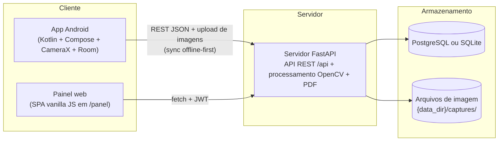

# FootScan — Escaneamento de pé pelo celular (MVP 2D calibrado)

O FootScan é um sistema de captura, medição e documentação do pé usando a câmera do
celular sobre uma **placa de calibração com marcadores ArUco**. O objetivo do MVP é
apoiar profissionais (podólogos, fisioterapeutas, ortesistas) na **medição do pé e na
fabricação de palmilhas personalizadas**, com registro histórico por paciente e
relatório em PDF.

> **Importante:** o FootScan **não realiza diagnóstico automático**. Ele produz
> medidas objetivas e documentação de apoio. A interpretação clínica é sempre do
> profissional responsável.

## Visão do produto

- **Captura 2D calibrada:** foto plantar do pé sobre uma placa com 4 marcadores
  ArUco de dimensões conhecidas. A homografia entre os marcadores permite converter
  pixels em milímetros com erro linear alvo ≤ 3 mm.
- **Medidas automáticas** por pé (esquerdo/direito), com ajuste manual de pontos
  quando necessário.
- **Histórico e comparação** entre exames do mesmo paciente e **assimetria** entre
  os pés (E − D).
- **Relatório em PDF** pronto para anexar ao prontuário ou enviar ao laboratório de
  palmilhas.
- **App Android offline-first:** grava localmente e sincroniza quando houver rede.
- **Conformidade LGPD:** consentimento registrado por paciente, controle de acesso
  por papel e trilha de auditoria (ver [docs/privacidade-lgpd.md](docs/privacidade-lgpd.md)).

## Arquitetura



- **App Android** (`android/`): cadastro de pacientes, captura guiada com moldura,
  fila de sincronização (`POST /api/sync/batch` + upload de capturas com
  `client_uuid` idempotente).
- **Servidor FastAPI** (`server/`): API REST, pipeline de processamento
  (detecção ArUco → retificação por homografia → segmentação → medidas),
  geração de PDF (reportlab) e painel web estático.
- **Banco de dados:** SQLite por padrão; PostgreSQL em produção via
  `FOOTSCAN_DB_URL`.
- **Painel web** (`webpanel/`): gestão de pacientes e exames, visualização do
  overlay, ajuste manual de pontos e download do PDF.

## Fluxo do app (infográfico)

1. **Cadastro** do paciente (com registro de consentimento LGPD).
2. **Seleção** do exame (novo exame para o paciente).
3. **Captura guiada:** foto plantar de cada pé sobre a placa, com moldura e
   instruções na tela.
4. **Processamento:** upload da imagem; o servidor detecta os marcadores,
   retifica, segmenta o pé e calcula as medidas.
5. **Resultados:** medidas por pé, overlay com contorno e pontos, assimetria E−D,
   comparação com o exame anterior, ajuste manual se necessário.
6. **PDF:** relatório completo do exame para impressão/arquivamento.

## O que o app mede

| # | Medida | Campo | Definição |
|---|---|---|---|
| 1 | Comprimento do pé | `length_mm` | extensão total ao longo do eixo longitudinal (PCA do contorno) |
| 2 | Largura do antepé | `forefoot_width_mm` | largura máxima perpendicular ao eixo na faixa 10–40% do comprimento |
| 3 | Largura do mediopé | `midfoot_width_mm` | largura mínima na faixa 40–70% |
| 4 | Largura do calcanhar | `heel_width_mm` | largura máxima na faixa 75–95% |
| 5 | Área de contato plantar | `plantar_area_cm2` | área do contorno segmentado (cm²) |
| 6 | Ângulo do eixo do pé | `axis_angle_deg` | ângulo do eixo longitudinal em relação ao eixo vertical da placa |
| 7 | Assimetria entre os pés | `asymmetry` | diferença esquerda − direita de cada medida linear e da área |
| 8 | Evolução entre exames | `previous_exam` / histórico | deltas em relação ao exame anterior do mesmo paciente |

Todas as medidas ficam em milímetros (área em cm²), no sistema métrico da placa
(origem no canto superior-esquerdo do retângulo dos marcadores). O contorno
(`contour_mm`) e os 8 pontos de referência (`landmarks`) são salvos junto para
permitir revisão e ajuste manual.

## Como rodar o servidor

Requisitos: Python 3.11+.

```bash
pip install -r server/requirements.txt
cd server && ./run.sh
```

O servidor sobe em `http://localhost:8000`. No primeiro start ele cria o banco e o
usuário administrador padrão:

- **E-mail:** `admin@clinica.local`
- **Senha:** `admin1234`

> **Troque as credenciais em produção** via variáveis de ambiente
> (`FOOTSCAN_ADMIN_EMAIL`, `FOOTSCAN_ADMIN_PASSWORD`) e defina uma
> `FOOTSCAN_SECRET_KEY` forte.

### Painel web

Acesse `http://localhost:8000/panel/` (a raiz `/` redireciona para o painel).
Faça login com o admin, cadastre pacientes, registre o consentimento, crie exames,
envie fotos e baixe o PDF.

### Gerar a placa de captura (PDF imprimível)

```bash
python3 server/tools/generate_markers.py            # gera placa_footscan.pdf
python3 server/tools/generate_markers.py --out minha_placa.pdf
```

Imprima em **escala 100% (tamanho real)** e monte conforme
[docs/kit-de-captura.md](docs/kit-de-captura.md).

### Gerar imagem de demonstração

```bash
python3 server/tools/make_demo_image.py             # gera demo_foot.jpg
python3 server/tools/make_demo_image.py --length-mm 245 --warp
```

A imagem sintética simula uma foto real da placa com um pé de dimensões conhecidas
— útil para testar o upload no painel sem o kit físico.

### Rodar os testes

```bash
cd server && python3 -m pytest
```

Os testes cobrem autenticação, CRUD de pacientes, fluxo completo de exame
(upload → medidas → overlay → PDF), sincronização offline e a acurácia do
pipeline (erro ≤ 3 mm na imagem sintética com perspectiva).

## Estrutura de pastas

```
README.md                  — este arquivo
SPEC.md                    — contrato técnico entre os módulos
server/
  requirements.txt         — dependências Python
  run.sh                   — inicia o uvicorn
  app/
    main.py                — app FastAPI, routers, /panel, bootstrap do admin
    config.py              — settings via env vars (prefixo FOOTSCAN_)
    database.py  models.py  schemas.py  security.py  deps.py  audit.py
    routers/               — auth, patients, exams, captures, reports, sync, users, audit
    processing/            — calibration, segmentation, measures, pipeline
    reportgen/             — geração do PDF (reportlab)
  tools/
    generate_markers.py    — PDF imprimível da placa (ArUco)
    make_demo_image.py     — imagem sintética de teste/demonstração
  tests/                   — pytest (API + processamento)
webpanel/                  — painel web estático (index.html, app.js, styles.css)
android/                   — scaffold do app Android (Kotlin + Compose)
docs/                      — documentação em pt-BR (ver abaixo)
```

## Variáveis de ambiente

Todas com prefixo `FOOTSCAN_` (via pydantic-settings):

| Variável | Default | Descrição |
|---|---|---|
| `FOOTSCAN_DB_URL` | `sqlite:///./footscan.db` | URL SQLAlchemy do banco (use PostgreSQL em produção) |
| `FOOTSCAN_DATA_DIR` | `./data` | diretório de dados; imagens em `{data_dir}/captures/` |
| `FOOTSCAN_SECRET_KEY` | `dev-secret-change-me` | chave dos tokens JWT — **obrigatório trocar em produção** |
| `FOOTSCAN_TOKEN_EXPIRE_MINUTES` | `480` | validade do token de acesso (minutos) |
| `FOOTSCAN_ADMIN_EMAIL` | `admin@clinica.local` | e-mail do admin criado no primeiro start |
| `FOOTSCAN_ADMIN_PASSWORD` | `admin1234` | senha do admin criado no primeiro start |
| `FOOTSCAN_ADMIN_NAME` | `Administrador` | nome do admin |

## Documentação

- [docs/kit-de-captura.md](docs/kit-de-captura.md) — especificação física da placa,
  montagem, iluminação e protocolo de captura.
- [docs/protocolo-validacao.md](docs/protocolo-validacao.md) — validação metrológica
  (paquímetro/régua), repetibilidade e critérios de aceite do MVP.
- [docs/privacidade-lgpd.md](docs/privacidade-lgpd.md) — base legal, consentimento,
  segurança e direitos do titular.
- [docs/roadmap-3d.md](docs/roadmap-3d.md) — Fases 2 e 3: escaneamento 3D,
  altura do arco e exportação de malhas.
- [SPEC.md](SPEC.md) — contrato técnico (rotas, formatos JSON, assinaturas).
